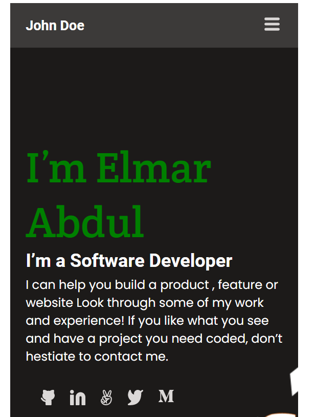

> Setup and mobile version skeleton

## Built With
- HTML
- CSS

## Getting Started
To get a local copy up

### Setup
Make sure the files are in the same folder. 

## Authors
👤 **Elmar Abdulkarimov**
- GitHub: [@elmar8287](https://github.com/elmar8287)

## 🤝 Contributing
Contributions, issues, and feature requests are welcome!

Feel free to check the [issues page](../../issues/).

## Show your support
Give a ⭐️ if you like this project!

## :memo: License
This project is [MIT](https://choosealicense.com/licenses/mit/) licensed.